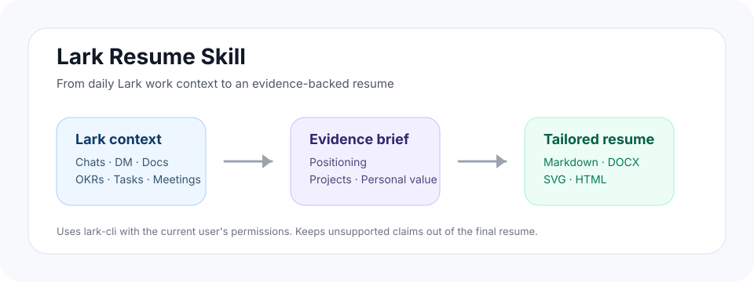
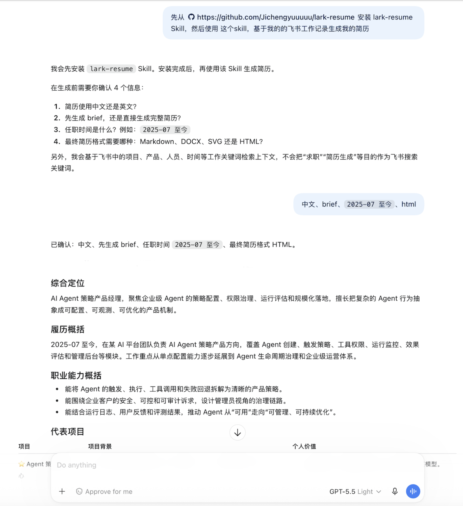
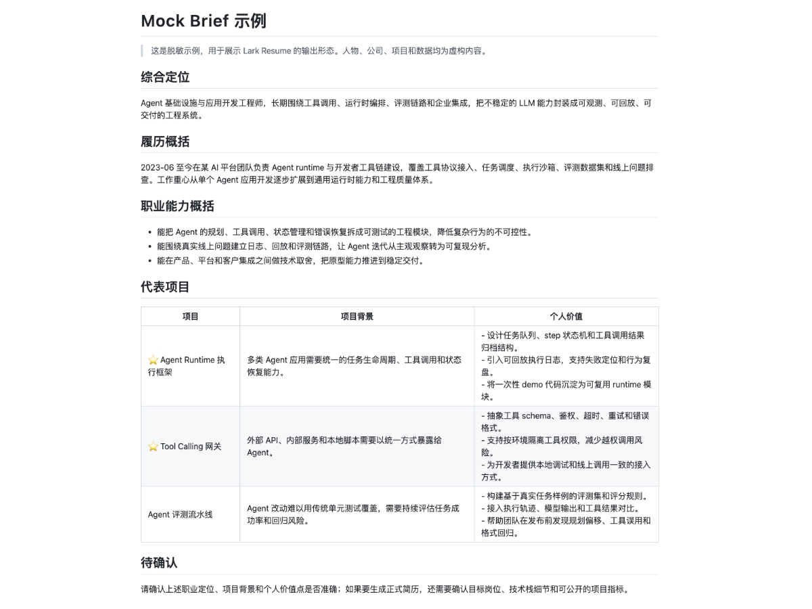
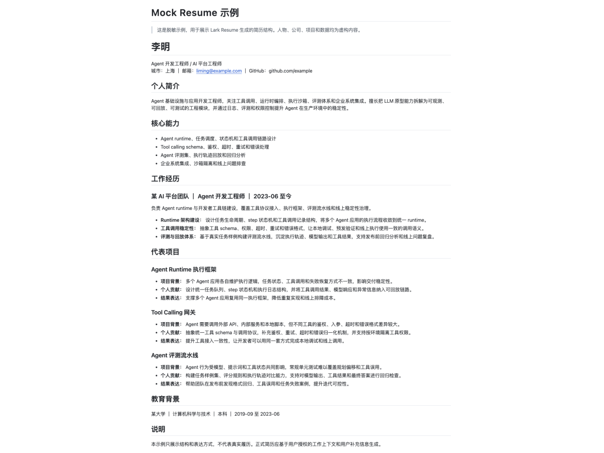

# Lark Resume Skill

Generate evidence-backed resumes from Lark / Feishu chats, direct messages, docs, OKRs, tasks, and meeting notes.

[中文说明](README.md) · [Mock brief](examples/brief.zh-CN.md) · [Mock resume](examples/resume.zh-CN.md)



Most resume generators start from what you remember. **Lark Resume** starts from what actually happened at work.

This repository provides an AI Agent Skill for turning day-to-day Lark context into a focused resume brief or a polished resume. It uses `lark-cli` to retrieve only the Lark content the signed-in user can access, then extracts personal contribution, project context, career positioning, and role-specific value from real evidence.

## Why this exists

People often do meaningful work in scattered places:

- group chats and direct messages;
- project docs, product specs, and review notes;
- OKRs, tasks, meeting notes, and delivery records.

When it is time to write a resume, that evidence is hard to recall and easy to distort. Lark Resume helps an agent rebuild the work history from source context, separate personal contribution from team outcomes, and write a resume that is useful for a target role.

## What it does

- Treats Lark group chats, direct messages, and documents as first-class resume evidence.
- Generates a concise brief before the final resume when the user wants a review step.
- Produces role-aware positioning, career summary, capability themes, experience bullets, and representative projects.
- Supports final output as Markdown, DOCX, SVG, or HTML.
- Keeps the brief in chat instead of forcing it into the final resume format.
- Asks whether to add optional modules such as contact details, education, certifications, portfolio, GitHub, publications, or language ability.
- Avoids inventing titles, dates, education, metrics, business outcomes, or unsupported skills.

## How it works

1. Confirm the resume language, generation flow, employment dates, and final resume format.
2. Check that `lark-cli` is installed and that Lark authorization is usable.
3. Retrieve relevant Lark context with work keywords, project names, people names, products, and dates.
4. Synthesize an evidence-backed brief with professional positioning and representative projects.
5. Generate a tailored resume that emphasizes the target role while preserving factual evidence boundaries.


## Usage example

The screenshot below is a mock example. It shows a user installing the Skill, the agent confirming the language, generation flow, employment dates, and final format, and then returning a Chinese brief. The content is fictional and does not include real Lark data.



## Quick start

Install this repository as a Skill in any compatible AI assistant or agent runtime, then make sure `lark-cli` is available in `PATH`.

```bash
command -v lark-cli
```

Then ask the agent:

```text
Create a resume from my Lark work history.
```

The Skill will confirm:

1. resume language: Chinese or English;
2. generation flow: brief first or full resume directly;
3. employment dates for each role;
4. final resume format: Markdown, DOCX, SVG, or HTML.

## Example request

```text
Please create a Chinese resume from my Lark context.
Generate a brief first.
Employment period: 2025-07 to present.
Final format: HTML.
```

The brief is returned directly in chat. The final resume is generated only after the brief is confirmed or revised.

See the anonymized mock outputs as screenshots and Markdown source:

### Mock brief



Source: [Chinese mock brief](examples/brief.zh-CN.md)

### Mock resume



Source: [Chinese mock resume](examples/resume.zh-CN.md)

## Evidence and privacy boundaries

Lark Resume is designed for evidence-backed resume writing, not broad data export.

- It only reads content available to the current Lark identity.
- It does not bypass permissions, audit controls, or search restrictions.
- It does not pass job-search or resume-generation intent into Lark search queries.
- It avoids exposing private message text, colleague identities, internal links, customer-sensitive details, or non-public metrics in the public resume.
- If a claim cannot be verified, the Skill omits it or marks it as needing confirmation.

## Repository structure

```text
lark-resume/
├── SKILL.md                 # Skill instructions in English
├── README.md                # English project overview
├── README.zh-CN.md          # Chinese project overview
├── LICENSE
├── assets/
│   └── flow.svg
├── examples/
│   ├── brief.zh-CN.md
│   └── resume.zh-CN.md
└── agents/
    └── openai.yaml
```

## Keywords

Lark resume skill, Feishu resume generator, AI resume builder, evidence-backed resume, AI Agent Skill, `lark-cli`, Lark chats, Feishu docs, OKR resume, DOCX resume, HTML resume.

## License

MIT
